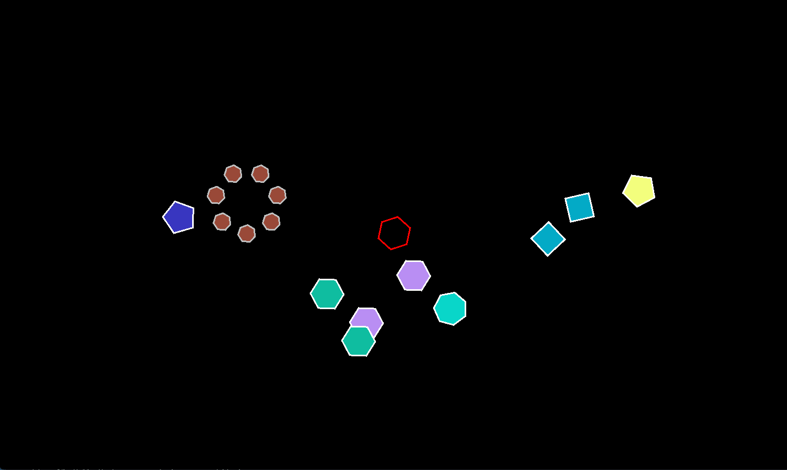

#### Shape Shooter Game

##### Structure of the Program

##### Specifications

###### Player Specifications

- The player is defined by a shape which is defined in the config file
- The player should spawn in the center of the screen at the beginning of the game, and after it dies (collides with an enemy)
- The player moves by a speed read from the config file in these directions

| key | movement |
| --- | -------- |
| A   | Left     |
| S   | Down     |
| D   | Right    |
| W   | Up       |

- The player is confined to move within the bounds of the window
- The player will shoot a bullet toward the mouse pointer when the left mouse button is clicked. The speed, size, and lifespan of the bullets are read from the config file.
- The player must have a `special ability`
  - Multiple bullets/entities must be spawned in this special ability (eg: Gravity Well)
  - Entities should have some unique graphic associated with them
  - A unique game game mechanic is introduced via a new component
  - A cooldown timer must be implemented for the special weapon
  - The properties of the special ability are up to you to implement

###### Enemy Specifications

- Enemies will spawn in a random location on the screen every X frames, where X is defined in the configuration file
- Enemies must not overlap the sides of the screen at the time of spawn.
- Enemies shapes hav random number of vertices, between a given minimum and maximum number, which is specified in the config file.
- Enemy shape radius will be specified in the configuration file
- Enemies will be given a random color upon spawning.
- Enemies will be given a random speed upon spawning, between a minimum and maximum value specified in the config file.
- When an enemy reaches the edge of the window, it should bounce off in the opposite direction at the same speed.
- The smaller enemies must have a radius equal to half of the orignal enemy.
- When large enemies collide with a bullet or the player, they are destroyde, and N small enemies spawn in its place, where N is the number of vertices. Each small enemy must have the same color and the number of vertices as the orignal enemy. These small entities (enemies) travel outwards at angles at a fixed intervals equal to (360 / vertices).
  For Example, if the orignal enemy had 6 sides, the 6 smaller enemies will travel outward in intervals of (360/6) = 60 degrees.

###### Score Specifications

- Each time an enemy spawns, it is given a score component of N\*100, where N is the number of vertices it has. Small enemies get double this value.
- If the player bullet kills an emeny, the game score is increased by the score component of the enemy killed.
- The score should be displayed with the font specified by the config file in the to-left corner of the screen.

###### Drawing Specifications

- In render system, all entities should be given a slow rotation, which makes the game look a little nicer.
- Any entity with a lifespan is currently alive, it should hav its Color alpha channel set to a ratio depending on how long it has left to live. For example if an entity has a 100 frame lifespan, and it has been alive for 50 frames, its alpha value should be set to 0.5 \* 255. the alpha should go from 255 wneh it is first spawned, to 0 on the last frame it is alive.

###### Misc Specifications

- the p key should pause the game
- the escape key should close the game

##### Configuration file

| Property | Given Attributes                                                                                                                                                                                        |
| -------- | ------------------------------------------------------------------------------------------------------------------------------------------------------------------------------------------------------- |
| Window   | W(width -> int) H(height -> int) FL(frame limit) FS(whether full screen or not)                                                                                                                         |
| Font     | F(font file link) S(size -> int) R G B(ints)                                                                                                                                                            |
| Player   | SR(shape radius -> int) CR(collision radius -> int) S(Magniude of the speed -> float) FR FG FB(fill colors -> ints) OR OG OB(outline colors -> ints) OT(outline thickness -> int) V(shape vertices int) |
| Enemy    | SR CR SMIN SMAX(speed min and max) OR OG OB OT VMIN VMAX(vertex count min max) L(small lifespan -> int) SI(spawn interval int)                                                                          |
| Bullet   | SR CR S(speed) FR FG FB OR OG OB OT V(shape vertices) L(lifespan)                                                                                                                                       |

##### what is left
- [ ] config file integration
- [ ] score keeping
- [ ] finishing touches
